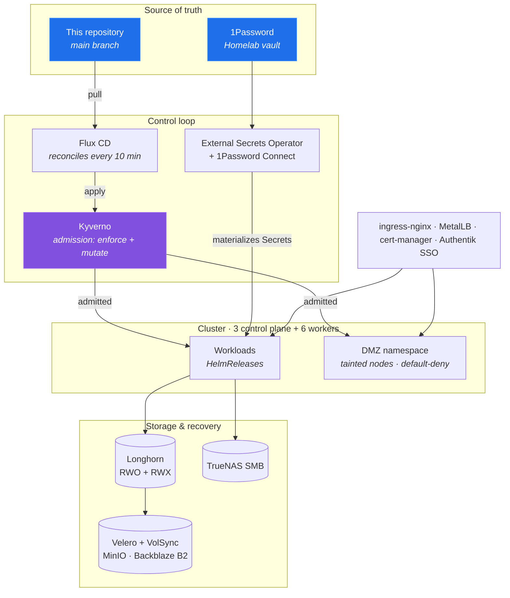

# Vollminlab Kubernetes Cluster

> A nine-node self-managed Kubernetes cluster where every workload, policy, and secret is defined as code and reconciled continuously from `main`.

[](https://github.com/vollminlab/k8s-vollminlab-cluster/actions/workflows/ci.yaml)
[](https://github.com/vollminlab/k8s-vollminlab-cluster/actions/workflows/secret-scanning.yaml)
[](https://github.com/vollminlab/k8s-vollminlab-cluster/actions/workflows/codeql.yml)


GitOps-managed Kubernetes cluster. All workloads are defined as code in this repository and reconciled continuously by Flux CD.

Nothing here is applied by hand. A change becomes real by merging a pull request; Flux notices within ten minutes and converges the cluster. If the cluster and this repository disagree, the repository wins.

> **Full configuration reference:** [docs/cluster-reference.md](docs/cluster-reference.md) — versions, resource limits, network policies, storage layout, and every configured value in excruciating detail.

---

## Architecture Overview



| Layer | Tool | Role |
|---|---|---|
| Orchestration | Kubernetes (kubeadm) | 3 control plane + 6 worker nodes |
| CNI | Calico | Pod networking, BGP, IPIP |
| GitOps | Flux CD | Continuous reconciliation from `main` |
| Helm management | Flux HelmRelease | All app deployments |
| Secret management | External Secrets Operator + 1Password Connect | Secrets materialized from 1Password — none stored in Git |
| Policy enforcement | Kyverno | Admission control (enforce + mutate) |
| Identity / SSO | Authentik | OIDC + nginx forward-auth for all ingresses |
| Ingress | ingress-nginx | HTTP/HTTPS routing |
| Certificates | cert-manager | TLS automation |
| Load balancing | MetalLB | Bare-metal LoadBalancer services |
| Block storage | Longhorn | Distributed RWO + RWX volumes |
| File storage | SMB CSI Driver | SMB/CIFS network shares |
| Backup | Velero + VolSync | Cluster backup to MinIO and Backblaze B2 |
| Monitoring | kube-prometheus-stack + VictoriaMetrics + Loki | Metrics, long-term storage, logs |
| CI | GitHub Actions (self-hosted ARC runners) | Manifest validation + policy checks |

---

## Repository Structure

```
bootstrap/                              # Manual bootstrap only — NOT Flux-managed
  calico/                               # Calico CNI install reference (apply before Flux)
  coredns/                              # CoreDNS config reference
  sealed-secrets/                       # Historical reference only — controller removed 2026-05-31

build/                                  # In-house container image sources, built by CI on a tag
  b2-exporter/                          # Backblaze B2 bucket metrics -> monitoring/ (b2-exporter/v* tag)

clusters/vollminlab-cluster/            # Everything Flux reconciles
  flux-system/
    repositories/                       # HelmRepository / OCIRepository / GitRepository sources
    flux-kustomizations/                # Flux Kustomization CRs (one per app/namespace)
  1password/                            # 1Password Connect (secret source for ESO)
  actions-runner-system/                # GitHub Actions ARC runners (scale set workloads)
  arc-controller/                       # GitHub ARC scale set controller
  authentik/                            # SSO / identity provider (OIDC + forward-auth)
  cert-manager/                         # TLS certificate automation
  clusterwide/                          # PersistentVolumes, StorageClasses, RBAC
  cnpg-system/                          # CloudNative PG operator
  dmz/                                  # Internet-exposed workloads (Minecraft, masters-league)
  external-dns/                         # Automated DNS record management (Pi-hole)
  external-secrets/                     # External Secrets Operator
  goldilocks/                           # Resource request/limit recommendations
  harbor/                               # Container registry + Docker Hub proxy cache
  homepage/                             # Homepage dashboard
  ingress-nginx/                        # Ingress controller
  kube-system/                          # metrics-server, smb-csi-driver, descheduler
  kyverno/                              # Policy engine + ClusterPolicies + policy-reporter
  local-path-storage/                   # Node-local storage provisioner
  longhorn-system/                      # Distributed block storage + rebalancing controller
  mediastack/                           # Jellyfin, *arr stack, downloaders, Audiobookshelf
  metallb-system/                       # Bare-metal load balancer
  minio/                                # S3-compatible object storage (Velero backend)
  monitoring/                           # Prometheus, Grafana, Loki, VictoriaMetrics, karma, exporters
  portainer/                            # Container management UI
  reloader/                             # Restarts workloads on ConfigMap/Secret change
  renovate/                             # Automated dependency updates
  shlink/                               # Short URL service + ingress annotation controller
  tailscale/                            # Tailscale operator
  tailscale-connector/                  # Subnet router / connector
  tofu/                                 # tofu-controller (OpenTofu IaC reconciliation)
  trivy-system/                         # Trivy operator (image + config scanning)
  velero/                               # Cluster backup (MinIO + Backblaze B2)
  volsync-system/                       # VolSync (PVC replication to backup targets)
  vollmint/                             # Personal budgeting app

docs/                                   # Documentation (synced to the Obsidian vault)
  runbooks/                             # Operational runbooks
scripts/                                # Utility scripts
terraform/                              # OpenTofu modules reconciled in-cluster by tofu-controller
```

> CI enforces this block. `scripts/check-readme-structure.sh` runs in the **Validate Kubernetes
> Manifests** check and fails the PR if a namespace directory is added or removed without the
> matching line here — so what you're reading is as current as the last merge.

---

## Deployed Applications

**This README deliberately carries no version numbers.** Versions drift with every Renovate
merge, and a hand-maintained table has nothing keeping it honest — the previous one claimed
Kyverno 3.7.2 while the cluster ran 3.8.2. Three sources are authoritative and maintain
themselves:

| Question | Where to look |
|---|---|
| What version is declared? | The app's `helmrelease.yaml`, or the `OCIRepository` `spec.ref.tag` |
| What's available / pending? | Renovate's **Dependency Dashboard** issue |
| What's actually running? | `flux get helmreleases -A` |

### Core Infrastructure

| App | Namespace | Purpose |
|---|---|---|
| Flux CD | flux-system | GitOps reconciliation |
| Headlamp | flux-system | Kubernetes UI with Flux plugin |
| Kyverno | kyverno | Policy enforcement |
| Policy Reporter | kyverno | Policy violation reporting |
| ingress-nginx | ingress-nginx | Ingress controller |
| cert-manager | cert-manager | TLS certificates |
| MetalLB | metallb-system | LoadBalancer IPs |
| External Secrets Operator | external-secrets | Materializes Secrets from 1Password |
| 1Password Connect | 1password | Secret backend for ESO |
| Authentik | authentik | SSO — OIDC + nginx forward-auth |
| metrics-server | kube-system | Resource metrics API |
| Descheduler | kube-system | Rebalances pods across nodes |
| External DNS | external-dns | Automated DNS records (Pi-hole) |
| CNPG Operator | cnpg-system | CloudNative PostgreSQL |
| Reloader | reloader | Restart on ConfigMap/Secret change |
| tofu-controller | tofu | OpenTofu reconciliation in-cluster |
| Tailscale Operator | tailscale | Tailnet ingress/egress |

### Storage & Backup

| App | Namespace | Purpose |
|---|---|---|
| Longhorn | longhorn-system | Distributed block storage (RWO + RWX) |
| Longhorn Rebalancing Controller | longhorn-system | Evens replica distribution across nodes |
| SMB CSI Driver | kube-system | SMB/CIFS network shares |
| Local Path Provisioner | local-path-storage | Node-local storage |
| MinIO | minio | S3-compatible object storage (Velero backend) |
| Velero | velero | Cluster backup — MinIO (2am) + Backblaze B2 (4am) |
| VolSync | volsync-system | PVC replication to backup targets |

StorageClasses: `longhorn` (default), `longhorn-r1`, `longhorn-r2`, `longhorn-dmz`,
`longhorn-static`, `local-path`, `local-vm-lt`, `smb`.

### Observability

| App | Namespace | Purpose |
|---|---|---|
| kube-prometheus-stack | monitoring | Prometheus, Alertmanager, Grafana |
| VictoriaMetrics | monitoring | Long-term metrics (395d cold tier) |
| Loki | monitoring | Log aggregation |
| Promtail | monitoring | Log shipping |
| karma | monitoring | Alertmanager dashboard UI |
| vmware-exporter | monitoring | ESXi/vCenter metrics |
| b2-exporter | monitoring | Backblaze B2 bucket metrics (plain Deployment, not Helm) |
| Goldilocks | goldilocks | Resource request recommendations |
| Trivy Operator | trivy-system | Image + config vulnerability scanning |

### Applications

| App | Namespace | Purpose |
|---|---|---|
| Homepage | homepage | Cluster dashboard |
| Portainer | portainer | Container management UI |
| Harbor | harbor | Container registry + Docker Hub proxy cache |
| Shlink | shlink | Short URL service (vollm.in) |
| Renovate | renovate | Automated dependency updates |
| vollmint | vollmint | Personal budgeting app |
| Jellyfin | mediastack | Media server |
| Jellystat | mediastack | Jellyfin usage statistics |
| Audiobookshelf | mediastack | Audiobook / podcast server |
| Seerr | mediastack | Media request management |
| Sonarr | mediastack | TV series automation |
| Radarr | mediastack | Movie automation |
| Readarr | mediastack | Book automation |
| Bazarr | mediastack | Subtitle management |
| Prowlarr | mediastack | Indexer aggregation |
| SABnzbd | mediastack | Usenet downloader |
| qBittorrent | mediastack | Torrent downloader (via gluetun VPN) |
| FlareSolverr | mediastack | Cloudflare challenge solver for indexers |
| Filebrowser | mediastack | Web file manager for media shares |
| Minecraft | dmz | Game server (internet-exposed, DMZ isolated) |
| masters-league | dmz | Fantasy league app (internet-exposed, DMZ isolated) |

### CI/CD

| App | Namespace | Purpose |
|---|---|---|
| ARC Scale Set Controller | arc-controller | Self-hosted GitHub Actions runners (ARC v2) |
| ARC Runner Scale Set | actions-runner-system | Runner pods (`runs-on: vollminlab`) |

---

## Cluster Bootstrap Order

For a full cluster rebuild, follow this order exactly:

```
1. Install Kubernetes control plane (kubeadm)
2. Install Calico CNI                 → see bootstrap/calico/README.md
3. Apply the onepassword-connect Secret in the 1password namespace
4. Bootstrap Flux CD                  → flux bootstrap github ...
5. Everything else                    → Flux reconciles automatically
```

**Steps 2 and 3 must happen before Flux bootstraps.** Calico is required for pod
networking. The `onepassword-connect` Secret (keys `1password-credentials.json` and
`token`) is the single root secret this cluster depends on: it is deliberately **not**
Flux-managed, and without it 1Password Connect cannot start, External Secrets Operator
cannot reach the vault, and **every other Secret in the cluster fails to materialize**.
Both values are stored in 1Password (Homelab vault).

> `bootstrap/sealed-secrets/` is retained as historical reference only. SealedSecrets are
> retired — the controller was removed 2026-05-31 and is no longer part of the DR path.

---

## Network Configuration

| Parameter | Value |
|---|---|
| Pod CIDR | `172.18.0.0/16` |
| CNI | Calico (IPIP encapsulation, BGP enabled) |
| Dataplane | iptables |
| Control plane replicas | 3 (`k8scp01`–`k8scp03`) |
| Worker nodes | 6 (`k8sworker01`–`k8sworker06`) |
| DMZ nodes | `k8sworker05`, `k8sworker06` (taint: `dmz=true:NoSchedule`) |

NetworkPolicy rules must use **container ports, not service ports** — policy is evaluated
post-DNAT at the pod interface. See `.claude/rules/networkpolicy.md`.

---

## Security Model

### Kyverno ClusterPolicies

Enforce mode — violations block admission:

| Policy | Rule |
|---|---|
| `restrict-default-namespace` | No workloads in the `default` namespace |
| `require-standard-labels` | All pods need `app`, `env`, `category` labels |
| `require-resources` | CPU/memory requests and limits required |
| `restrict-privileged` | No privileged containers |
| `restrict-hostpath-usage` | No hostPath volumes |
| `restrict-latest-tag` | No `:latest` image tags |
| `restrict-image-registries` | Images only from allowed registries |
| `restrict-loadbalancer-services` | LoadBalancer services restricted |
| `dmz-restrict-external-access` | External access labels only allowed in `dmz/` |

Mutate/audit mode — inject defaults, do not block:

| Policy | Rule |
|---|---|
| `dmz-enforce-node-placement` | DMZ pods auto-targeted to DMZ nodes |
| `inject-namespace-labels` | Auto-label namespaces |
| `inject-pod-labels` | Auto-label pods |
| `inject-resource-requirements` | Auto-inject default limits |
| `mutate-default-sa-automount` | Disable SA token automount by default |
| `mutate-default-sa-pod-automount` | Same, at pod level |

Autogen has bitten this cluster before — never mix `Pod` and controller kinds in one rule,
and disable autogen on any policy using an `apiCall` context. See `.claude/rules/kyverno.md`.

### DMZ Isolation

The `dmz/` namespace is a security boundary for internet-exposed workloads. See
[clusters/vollminlab-cluster/dmz/README.md](clusters/vollminlab-cluster/dmz/README.md) for
the full security model.

- Dedicated nodes (`k8sworker05`, `k8sworker06`) with `dmz=true:NoSchedule` taint
- Kyverno auto-enforces node placement for all dmz pods
- Default-deny NetworkPolicy with explicit allow rules only
- Dedicated `longhorn-dmz` StorageClass for node-local storage isolation

### Secret Management

Every Secret in this cluster is materialized by the **External Secrets Operator** from
**1Password** via **1Password Connect**:

```
1Password (Homelab vault)
  └─ 1Password Connect            (1password namespace)
       └─ ClusterSecretStore      (onepassword-cluster-store)
            └─ ExternalSecret     (one per app, in the app's namespace)
                 └─ Secret        (materialized by ESO, creationPolicy: Owner)
```

The repository contains only `ExternalSecret` CRs that *reference* vault items by title —
never the values. Hard rules, enforced by gitleaks on every PR:

- Never commit a plain `kind: Secret`
- Never commit a `SealedSecret` — the controller is gone; it will never reconcile
- Never commit API keys, passwords, or tokens in any file
- Never put a secret value in a ConfigMap — reference it via `secretKeyRef`

See `.claude/rules/secrets.md` for the full ESO workflow and naming conventions.

### Authentication

Ingresses are protected by Authentik. Apps with native SSO (Grafana, Harbor, Headlamp,
Jellyfin, MinIO, Portainer, Audiobookshelf) use dedicated OIDC providers; everything else
uses the domain-wide `vollminlab-forward-auth` proxy provider via nginx `auth_request`.
Every protected host needs an Authentik Application entry, even when it has no provider
of its own. Authentik configuration is managed by OpenTofu.

---

## Making Changes

```
1. Create a branch from a freshly pulled main
2. Make changes
3. Push — CI runs automatically
4. Open a PR — all required checks must pass
5. Merge to main — Flux reconciles within 10 minutes
```

Direct pushes to `main` are blocked; branch protection is enforced via GitHub repository
settings and applies to admins. Because up-to-date branches are required, merging several
PRs in a row means running `gh pr update-branch <n>` and letting checks re-run before each
merge.

CI (`.github/workflows/ci.yaml`) runs: manifest validation, integration test (deploys into
a throwaway `ci-test-*` namespace on the live cluster), Trivy security scan, Kyverno policy
validation, and OpenTofu validation. Secret scanning (gitleaks) and CodeQL run as separate
workflows.

Jobs run on the self-hosted ARC runners in this cluster. If those runners are down,
required checks pend forever and nothing can merge — including the fix. Break glass with
the `CI_RUNNER` repo variable; see [docs/runbooks/ci-runner-breakglass.md](docs/runbooks/ci-runner-breakglass.md).

---

## Adding a New Application

1. Create the namespace directory: `clusters/vollminlab-cluster/[namespace]/`
2. Add `namespace.yaml` and `kustomization.yaml`
3. Create the app directory: `[namespace]/[app-name]/app/`
4. Add `kustomization.yaml`, `helmrelease.yaml`, `configmap.yaml` (Helm values live in the
   ConfigMap and are referenced via `valuesFrom` — never inline `values:`)
5. Add a source to `flux-system/repositories/` **and** list it in that directory's
   `kustomization.yaml`
6. Add a Flux Kustomization CR to `flux-system/flux-kustomizations/` **and** list it in
   that directory's `kustomization.yaml`
7. Ensure all pod labels include `app`, `env: production`, and a valid `category`
8. Secrets must be `ExternalSecret` objects sourced from 1Password — never plain `Secret`
9. Every new Ingress needs a `shlink.vollminlab.com/slug: <service-name>` annotation and,
   if Authentik-protected, a matching Authentik Application

Both `kustomization.yaml` index files in step 5 and 6 are **explicit lists, not globs**.
Flux silently ignores anything not listed — missing either one means the app never deploys.
Copy-paste templates: [docs/runbooks/flux-templates.md](docs/runbooks/flux-templates.md).

---

## Useful Commands

```bash
# Flux reconciliation state
flux get kustomizations -A
flux get helmreleases -A

# Force reconciliation
flux reconcile kustomization [name] --with-source

# Check Kyverno violations
kubectl get policyreport -A
kubectl get clusterpolicyreport

# ExternalSecret sync status (READY=True means ESO reached 1Password)
kubectl get externalsecret -A

# Backup status
kubectl get schedules.velero.io -n velero
kubectl get backups.velero.io -n velero --sort-by=.metadata.creationTimestamp

# Calico status (NOT Flux-managed — check manually)
kubectl get tigerastatus
kubectl get pods -n calico-system
```
