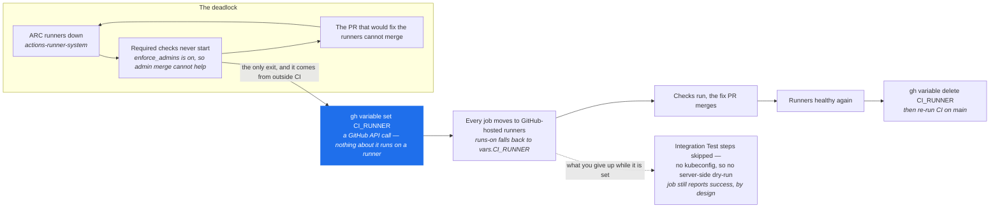

# CI Runner Break-Glass

How to merge a PR when the self-hosted ARC runners are down.

## The deadlock this exists to break

Every CI job in this repo normally runs on the self-hosted `vollminlab` runner set
(ARC, `actions-runner-system` namespace). Branch protection makes those jobs
required checks with `enforce_admins` on. The failure mode is a closed loop:
dead runners block the checks, the blocked checks block the PR, and that PR is
the one that would bring the runners back.



Nothing inside the loop breaks it. Admin merge does not help (`enforce_admins`
is enabled), and disabling branch protection to escape is worse than the outage.

## The escape hatch

Every job declares:

```yaml
runs-on: ${{ vars.CI_RUNNER || 'vollminlab' }}
```

Setting the repo variable `CI_RUNNER` moves **all** CI onto GitHub-hosted runners.
The repo is public, so hosted minutes are free. Setting a repo variable is a
GitHub API call — nothing about it can be blocked by broken CI.

### Enter break-glass

```bash
gh variable set CI_RUNNER --repo vollminlab/k8s-vollminlab-cluster --body ubuntu-latest
# then re-run the stuck checks
gh pr checks <PR#> --repo vollminlab/k8s-vollminlab-cluster   # find the run
gh run rerun <run-id> --repo vollminlab/k8s-vollminlab-cluster
```

### Leave break-glass — do this as soon as the runners are healthy

```bash
gh variable delete CI_RUNNER --repo vollminlab/k8s-vollminlab-cluster
```

Verify the runners first:

```bash
kubectl get pods -n actions-runner-system
kubectl get autoscalingrunnerset -n actions-runner-system
```

## What you give up while it is set

`Integration Test` is the only job that touches the live cluster (server-side
`--dry-run` of every changed HelmRelease into an ephemeral `ci-test-*` namespace).
A GitHub-hosted runner has no kubeconfig, so that job's steps are skipped via
`env.CLUSTER_CI` and the job reports **success** with a `::warning::` in the run
summary:

> Cluster validation skipped — server-side dry-run against the live cluster did NOT run.

Skipping the steps (rather than letting the job fail or never run) is deliberate:
a required check that is *pending forever* is exactly what causes the deadlock.

Everything else — manifest validation, Kyverno policy tests, Trivy, gitleaks,
Terraform validate — runs normally on hosted runners and still gates the
merge.

**Therefore:** treat break-glass as a short-lived state. Any manifest merged while
it is set has not been dry-run against the API server. After unsetting `CI_RUNNER`,
re-run CI on `main` (`gh workflow run "CI Pipeline" --ref main`) to get that
coverage back.

## Related

- `docs/runbooks/incidents.md` — incident history
- ARC config: `clusters/vollminlab-cluster/actions-runner-system/`
