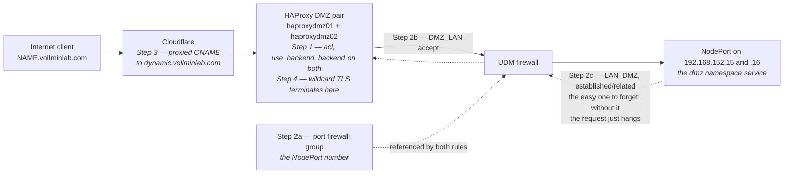

# Runbook: Expose a New DMZ Service Externally

Use this when you have a new k8s service in the `dmz` namespace that needs to be reachable from the internet via `*.vollminlab.com`.

The full stack is: **Cloudflare → HAProxy DMZ → UDM firewall → k8s NodePort**. Each
step below configures one hop of that path:



---

## Prerequisites

- Service is deployed in the `dmz` namespace with a `NodePort` service
- NodePort is allocated (check `kubectl get svc -n dmz`)
- Image is built and pushed to `harbor.vollminlab.com/homelab/<name>`

---

## Step 1: HAProxy — both nodes

SSH into **haproxydmz01** and **haproxydmz02** and make the same edit to `/etc/haproxy/haproxy.cfg` on each.

```bash
ssh haproxydmz01.vollminlab.com
sudo vim /etc/haproxy/haproxy.cfg
```

### In `frontend ft_https` — add ACL and use_backend (after the existing `acl host_bluemap` line):

```haproxy
    acl host_<name> hdr(host) -i <subdomain>.vollminlab.com
    use_backend bk_<name> if host_<name>
```

### Add a new backend (after `bk_bluemap`):

```haproxy
backend bk_<name>
        mode http
        option httpchk GET /api/health
        http-check expect status 200
        balance roundrobin
        server <name>05 192.168.152.15:<nodeport> check inter 3000 fall 3 rise 2
        server <name>06 192.168.152.16:<nodeport> check inter 3000 fall 3 rise 2
```

> For TCP services (like Minecraft), add a `frontend ft_<name>` instead and use `mode tcp`. See `ft_minecraft` / `bk_minecraft` as the template.

### Validate and reload on each node:

```bash
sudo haproxy -c -f /etc/haproxy/haproxy.cfg
sudo systemctl reload haproxy
```

Repeat on **haproxydmz02**.

---

## Step 2: UDM Firewall — three sub-steps

### 2a. Create a port firewall group

In UniFi → **Settings → Firewall & Security** → scroll to **Network Lists** → **Create New**:

| Field | Value |
|-------|-------|
| Name | `<Name> Nodeport` |
| Type | Port |
| Value | `<nodeport>` |

Existing examples: `Minecraft Nodeport` (32565), `Bluemap Nodeport` (32566).

### 2b. Add DMZ_LAN rule

In **Firewall Rules → DMZ_LAN**, add a rule **before** "Allow Return Traffic":

| Field | Value |
|-------|-------|
| Description | `Allow haproxydmz -[<Name>]> k8sworker05` |
| Action | Accept |
| Protocol | TCP |
| Source | `HAProxy DMZ Hosts` |
| Destination | `<Name> Nodeport` + `k8s DMZ Hosts` |
| Log | On |

### 2c. Add LAN_DMZ return rule

In **Firewall Rules → LAN_DMZ**, add a rule **before** "Isolated Networks":

| Field | Value |
|-------|-------|
| Description | `Allow haproxydmz -[<Name>]> k8sworker05 (Return)` |
| Action | Accept |
| Protocol | TCP |
| Source | `<Name> Nodeport` + `k8s DMZ Hosts` |
| Destination | `HAProxy DMZ Hosts` |
| Connection State | Established / Related |

---

## Step 3: Cloudflare DNS

In Cloudflare → `vollminlab.com` zone → **DNS → Records** → Add record:

| Type | Name | Target | Proxy status |
|------|------|--------|--------------|
| CNAME | `<subdomain>` | `dynamic.vollminlab.com` | Proxied (orange cloud) |

---

## Step 4: TLS certificate

Check that `/etc/haproxy/certs/` on both DMZ nodes already covers the new subdomain. If you have a wildcard `*.vollminlab.com` cert, nothing to do.

---

## Step 5: Verify

```bash
# DNS resolves
dig <subdomain>.vollminlab.com +short

# Health check responds
curl -I https://<subdomain>.vollminlab.com/api/health

# HAProxy stats (optional)
curl -s http://haproxydmz01.vollminlab.com:8404/stats | grep <name>
```

---

## Reference: existing DMZ services

| Service | Subdomain | NodePort | Protocol |
|---------|-----------|----------|----------|
| Bluemap | `bluemap.vollminlab.com` | 32566 | HTTP |
| Minecraft | *(port forward, not HTTP)* | 32565 | TCP |
| Masters League | `mastersleague.vollminlab.com` | 32567 | HTTP |
