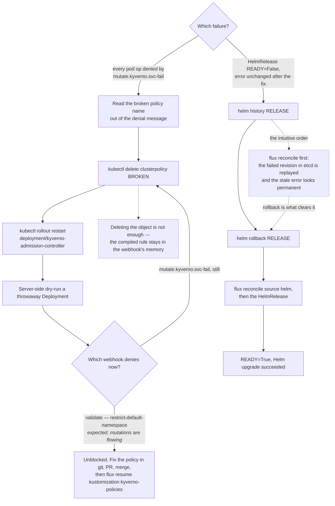

# Kyverno Emergency Recovery

Both recoveries below hinge on an ordering constraint where the intuitive order
is the broken one: deleting the ClusterPolicy is not what unblocks the webhook
(the restart is), and reconciling is not what clears a stuck HelmRelease (the
rollback is).



## Webhook blocking all mutations

Symptom: `admission webhook "mutate.kyverno.svc-fail" denied the request` on every pod/deployment operation.

```bash
# Step 1 — identify the broken policy from the error message
# "mutation policy <name> error: ..." — the name is in the denial message

# Step 2 — delete the broken ClusterPolicy
kubectl delete clusterpolicy <broken-policy-name>

# Step 3 — restart admission controller to clear in-memory policy cache
# Deleting the policy object alone is not enough — the compiled rule stays in memory
kubectl rollout restart deployment/kyverno-admission-controller -n kyverno
kubectl rollout status deployment/kyverno-admission-controller -n kyverno --timeout=120s

# Step 4 — verify webhook is unblocked
kubectl create deployment test-block --image=nginx:1.25 -n default --dry-run=server 2>&1
# SUCCESS: "blocked due to restrict-default-namespace" (validate webhook, expected)
# STILL BROKEN: "mutate.kyverno.svc-fail denied" (delete more policies, restart again)

# Step 5 — fix the policy in git, PR, merge
# Step 6 — resume kyverno-policies Kustomization if it was suspended
flux resume kustomization kyverno-policies -n flux-system
```

**If patching the webhook failurePolicy to Ignore seems easier:** Kyverno auto-restores it within seconds. Deleting the broken policy + restarting the admission controller is the reliable path.

## HelmRelease stuck in failure loop

Symptom: `READY=False` with a stale error message even after the root cause is fixed.

This happens because Flux stores Helm release state in etcd. When an upgrade fails, the failed revision is recorded and replayed on every reconcile — making it appear the original problem persists.

```bash
# Step 1 — inspect Helm release history
helm history <release-name> -n <namespace>

# Step 2 — roll back to the last good revision
helm rollback <release-name> -n <namespace>

# Step 3 — reconcile fresh
flux reconcile source helm <repo-name> -n flux-system
flux reconcile helmrelease <release-name> -n <namespace>

# Step 4 — verify
flux get helmrelease <release-name> -n <namespace>
# Should show: READY=True, MESSAGE="Helm upgrade succeeded"
```

**Key:** Retrying `flux reconcile` before `helm rollback` will continue to show the stale failure message. Rollback must come first.
