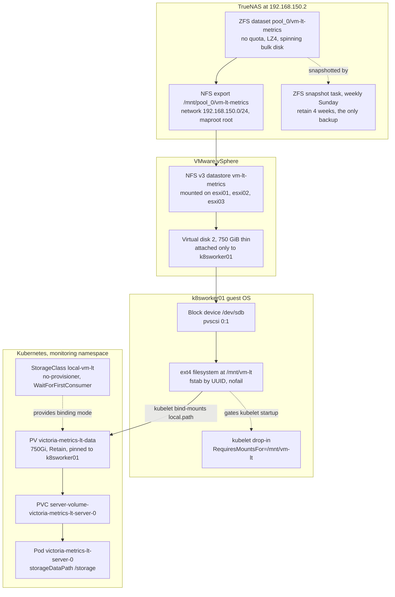

# The `vm-lt-metrics` Storage Path

`vm-lt-metrics` is the storage path behind the **VictoriaMetrics cold tier** — the second,
long-retention VictoriaMetrics instance (`victoria-metrics-lt`) that holds roughly 13 months of
cluster metrics. It exists so that a full year of history lives on cheap TrueNAS spinning disk
instead of consuming replicated Longhorn SSD, and it is the one storage chain in this cluster that
crosses **all four** layers — ZFS, NFS, VMware, and Linux — before Kubernetes ever sees it.

Because every hop is manual and out-of-band, none of it is Flux-managed and none of it appears in
the collected-config snapshots in `homelab-infrastructure`. This document is the source of truth
for the whole path.

Design rationale (why a second single-node instance rather than VM cluster mode, why NFS rather
than iSCSI): `docs/superpowers/specs/victoriametrics-cold-tier-design.md`.
Build steps: `docs/superpowers/plans/victoriametrics-cold-tier.md`.

---

## The chain



### Hop by hop

| # | Layer | Identifier | Where it is defined | How to verify |
|---|-------|-----------|--------------------|---------------|
| 1 | TrueNAS ZFS dataset | `pool_0/vm-lt-metrics` at `/mnt/pool_0/vm-lt-metrics` — no quota, no reservation, LZ4, 128K recordsize | Manual — TrueNAS UI only | TrueNAS UI: Datasets → `pool_0` |
| 2 | TrueNAS NFS export | same path, comment "VictoriaMetrics Longterm Cold Storage", authorized by **network** `192.168.150.0/24` with no per-host list, `maproot_user: root` / `maproot_group: wheel` | Manual — TrueNAS UI only | TrueNAS UI: Shares → NFS |
| 3 | vSphere datastore | `vm-lt-metrics` — **NFS v3**, remote `nfs.vollminlab.com:/mnt/pool_0/vm-lt-metrics`, mounted read-write on **all three** ESXi hosts | Manual — vCenter only | `govc datastore.info vm-lt-metrics` |
| 4 | Virtual disk | Hard disk 2, **750 GiB thin**, `[vm-lt-metrics] k8sworker01/k8sworker01.vmdk`, pvscsi controller 0 unit 1, attached **only** to `k8sworker01` | Manual — vCenter only | `govc device.info -vm k8sworker01 disk-*` |
| 5 | Guest block device | `/dev/sdb` — the guest enumerates pvscsi 0:1 as SCSI address `2:0:1:0` | Guest hot-add | `lsblk` on k8sworker01 |
| 6 | Guest filesystem | ext4 label `vm-lt` at `/mnt/vm-lt`, fstab by `UUID=`, options `defaults,noatime,nofail` | `/etc/fstab` on k8sworker01 | `findmnt /mnt/vm-lt` |
| 7 | kubelet ordering | drop-in `/etc/systemd/system/kubelet.service.d/20-vm-lt-mount.conf` | `ansible-playbooks/playbooks/kubelet-vm-lt-mount-ordering.yml` | `systemctl show kubelet.service -p DropInPaths` |
| 8 | StorageClass | `local-vm-lt` — `no-provisioner`, `WaitForFirstConsumer`, `Retain` | `clusters/vollminlab-cluster/monitoring/victoria-metrics-lt/app/storageclass.yaml` | `kubectl get sc local-vm-lt` |
| 9 | PersistentVolume | `victoria-metrics-lt-data`, 750Gi, `local.path: /mnt/vm-lt`, `nodeAffinity` → `k8sworker01` | `clusters/vollminlab-cluster/monitoring/victoria-metrics-lt/app/pv.yaml` | `kubectl get pv victoria-metrics-lt-data` |
| 10 | PersistentVolumeClaim | `server-volume-victoria-metrics-lt-server-0` — emitted by the StatefulSet `volumeClaimTemplate` | `clusters/vollminlab-cluster/monitoring/victoria-metrics-lt/app/configmap.yaml` | `kubectl get pvc -n monitoring` |
| 11 | Workload | StatefulSet `victoria-metrics-lt-server`, container flag `--storageDataPath=/storage` | `clusters/vollminlab-cluster/monitoring/victoria-metrics-lt/app/helmrelease.yaml` + `configmap.yaml` | `kubectl get sts -n monitoring victoria-metrics-lt-server` |

Hops 1–6 are **manual and unmanaged**: there is no Terraform, no Ansible, and no collected-config
JSON that describes them. Hop 7 is Ansible. Hops 8–11 are Flux.

Two things follow from the datastore being mounted on **all three** ESXi hosts rather than only the
one currently running the VM. vMotion of `k8sworker01` between hosts is safe and transparent — the
disk follows the VM and the guest never notices, because the Kubernetes pin is to the *node name*,
not to a hypervisor. But it also means the export is reachable by every host on the storage VLAN,
which matches the share being authorized by network rather than by host list.

---

## Hot tier vs cold tier

Two independent single-node VictoriaMetrics instances, both fed the same stream. Neither is a
replica of the other; VictoriaMetrics OSS cannot tier by age, so "old data on cheap disk" is
realized by running a second instance with a longer retention on cheap disk.

| | Hot tier | Cold tier |
|---|---|---|
| HelmRelease | `victoria-metrics` | `victoria-metrics-lt` |
| Service | `victoria-metrics-single-server.monitoring.svc:8428` | `victoria-metrics-lt-server.monitoring.svc:8428` |
| Retention | `30d` | `395d` — about 13 months |
| Volume | 60Gi, `longhorn-r2` StorageClass, replicated SSD | 750Gi, `local-vm-lt` StorageClass, single spinning disk |
| Placement | soft pod anti-affinity, floats across general workers | **hard-pinned to k8sworker01** by PV `nodeAffinity` |
| Pod label `app` | `victoria-metrics` | `victoria-metrics-lt` |
| Backed up by Velero | yes — `velero-victoria-metrics-b2` schedule | **no, deliberately** |
| Grafana datasource uid | `prometheus` — the default | `victoriametrics-lt` |

Retention values live in each tier's `configmap.yaml` under
`clusters/vollminlab-cluster/monitoring/`; chart versions live in each `helmrelease.yaml` and are
Renovate-managed — read them from the file rather than from this page.

**Everything older than 30 days exists only on the cold tier.** There is no second copy anywhere.

---

## How data gets in

Prometheus is a short-lived scrape buffer, not the store of record: it keeps `retention: 24h`
locally and fans out via **two independent `remoteWrite` endpoints**, one per tier. There is no
vmagent, no vminsert, and no VM-to-VM replication.

```
kube-prometheus-stack Prometheus  (scrapeInterval 30s, local retention 24h)
   ├── remoteWrite #1 ──▶ victoria-metrics-single-server:8428   (hot, 30d, Longhorn SSD)
   └── remoteWrite #2 ──▶ victoria-metrics-lt-server:8428       (cold, 395d, pool_0 disk)
       name: vm-lt, own queueConfig
```

Defined in `clusters/vollminlab-cluster/monitoring/kube-prometheus-stack/app/configmap.yaml`.

The second endpoint carries an explicit `queueConfig` (`capacity`, `maxShards`,
`maxSamplesPerSend`) purely to **isolate the slow endpoint**. Each `remoteWrite` target has its own
in-memory shard queue, so if pool_0 falls behind, the cold queue backs up alone — the hot write and
Prometheus scraping are unaffected.

Health check, both endpoints should read `0`:

```bash
# from any pod that has curl, e.g. the grafana container
curl -s --data-urlencode \
  'query=sum by (url) (rate(prometheus_remote_storage_samples_failed_total[1h]))' \
  http://kube-prometheus-stack-prometheus.monitoring.svc.cluster.local:9090/api/v1/query
```

The cold tier also exposes its own `/metrics` via an enabled `serviceMonitor`, so its ingestion
rate and disk growth are scraped by Prometheus and therefore land in *both* tiers.

---

## How data gets out

Grafana has four datasources, all declared in
`clusters/vollminlab-cluster/monitoring/kube-prometheus-stack/app/configmap.yaml` under
`grafana.additionalDataSources`. Note that `defaultDatasourceEnabled: false` — the stock Prometheus
datasource is suppressed and the **hot VictoriaMetrics instance owns `uid: prometheus`** instead.
That is why dashboards written against `uid: prometheus` transparently query VictoriaMetrics.

| Datasource name | `uid` | Points at | Default |
|---|---|---|---|
| VictoriaMetrics | `prometheus` | hot tier, 30d | yes |
| Prometheus (live) | `prometheus-live` | the Prometheus pod itself, 24h | no |
| VictoriaMetrics (long-term) | `victoriametrics-lt` | **cold tier, 395d** | no |
| Loki | auto | Loki | no |

There is no query router. **A dashboard panel must explicitly select
`VictoriaMetrics (long-term)` to see anything older than 30 days** — a panel left on the default
datasource with a 6-month range silently returns 30 days of data and empty space before it.
Fronting both tiers with a single `vmauth` endpoint was considered and deferred.

---

## The non-obvious parts

### 1. An unmounted filesystem is a silent data-destination swap, not an error

This is the trap the whole `kubelet-vm-lt-mount-ordering.yml` playbook exists to close.

The PV is `local` type, so kubelet **bind-mounts `local.path` into the pod**. If the ext4
filesystem is not mounted at `/mnt/vm-lt` when kubelet sets up the volume, kubelet happily binds
the empty *underlying directory on the root LV* instead. No error. No event. The pod starts, the
PVC shows `Bound`, and VictoriaMetrics writes cold-tier data onto k8sworker01's root disk.

This happened on **2026-07-08**: the disk was hot-added but never mounted, and `nofail` in fstab
kept the missing mount from being noticed at boot. At the observed ingest rate it would eventually
have filled the root volume and taken the node `NotReady`.

The fix is a kubelet drop-in:

```ini
[Unit]
RequiresMountsFor=/mnt/vm-lt
```

systemd expands that into `Requires=` + `After=` on the `mnt-vm\x2dlt.mount` unit, so kubelet
**refuses to start** until the filesystem is mounted. The silent wrong-target bind becomes a hard,
visible ordering failure.

Two constraints on that drop-in:

- **k8sworker01 only.** No other node has `/mnt/vm-lt`. A cluster-wide `RequiresMountsFor` would
  prevent kubelet from ever starting anywhere else. The playbook is scoped to a single host.
- **`nofail` in fstab stays.** It keeps a missing disk from blocking the *node's* boot. Only
  kubelet gains the dependency, which is exactly the right granularity: the node comes up and stays
  reachable, but it will not run pods until the cold-tier volume is real.

The playbook refuses to install the drop-in unless `/mnt/vm-lt` is currently a real mountpoint
**and** has an fstab entry — otherwise the ordering dependency would wedge kubelet at the next
reboot with no mount unit to satisfy it. It runs `daemon-reload` only and never restarts kubelet.

```bash
# verify the ordering is in place
systemctl show kubelet.service -p DropInPaths
systemctl show kubelet.service -p After --value | grep -o 'mnt-vm.x2dlt.mount'
```

### 2. The pod label `app: victoria-metrics-lt` is load-bearing

The Velero schedule `velero-victoria-metrics-b2` selects on `matchLabels: {app: victoria-metrics}`.
Labelling the cold tier `victoria-metrics` — the obvious, tidy-looking thing to do — would sweep
750Gi of "nice to have" history into a **daily Backblaze B2 backup**, which is precisely what this
whole design exists to avoid.

The distinct label is the only thing keeping the cold volume out of that schedule. It is set in
`server.podLabels` in the cold tier's `configmap.yaml`. Do not "normalize" it.

### 3. `local` PV is not a pod `hostPath` volume

The Kyverno "no hostPath" policy is in **enforce** mode and targets *Pod* specs. A
`PersistentVolume` with a `local:` source is a different API object and is not matched; the pod
only ever mounts a PVC. This passes policy and `kyverno-cli test` in CI. It looks like a violation
and is not.

### 4. `395d` is a ceiling, not a backfill

Retention says how far back data is *kept*, not how far back data *exists*. The cold tier's history
starts the day the volume went live and grows forward one day per day. Nothing was backfilled from
the hot tier, so metrics predating the cold tier's first write are gone permanently — they aged out
of the hot tier's 30-day window.

Probed on 2026-08-17, the cold tier returned data at 2026-07-09 and nothing at 2026-07-08 — i.e.
its history floor is the day after the mount incident described above, and it held about 39 days of
data, not 395.

Probe the actual floor rather than assuming:

```bash
# walk backwards until the result set is empty; that boundary is the real history floor
curl -s "http://victoria-metrics-lt-server.monitoring.svc.cluster.local:8428/api/v1/query?query=count(up)&time=$(date -d '-200 days' +%s)"
```

The tier will not hold a genuine 13 months until roughly 13 months after it was first written to.

### 5. Cold-tier queries are visibly slower, and that is the design

Spinning disk behind a 750Gi dataset means wide queries pay for it. A `count(up)` over the full
cold tier has been observed taking multiple **seconds**; the identical query against the hot tier
returns in tens of milliseconds. This is the accepted trade and the reason the cold tier is not the
default datasource. If year-range dashboards ever become painful, the planned remedy is OSS
`vmagent` stream-aggregation downsampling on the LT stream — deferred, not implemented.

### 6. The thin VMDK only ever grows — this disk cannot TRIM

The guest and the hypervisor disagree wildly about how much space this volume uses, and the
disagreement is permanent. Observed on 2026-08-17:

| View | Reported usage |
|---|---|
| Guest ext4 — `df /storage` | ~49 GiB |
| VMDK actual allocation on the datastore | ~258 GB |
| ZFS dataset including snapshots | ~371 GiB, of which ~113 GiB is snapshots |

The cause: `/dev/sdb` reports **no discard capability**. `lsblk -D /dev/sdb` shows `DISC-MAX 0B`,
the datastore's Hardware Acceleration is "Not Supported" — normal for NFSv3 without a VAAI NAS
plugin — and the filesystem is mounted without `discard`. Ubuntu's weekly `fstrim.timer` is enabled
and runs, but it **cannot reclaim anything here**.

VictoriaMetrics continuously merges and deletes parts, so it touches far more distinct blocks than
it holds at any instant. Every block ever written stays allocated in the thin VMDK forever. The
practical consequences:

- Thin provisioning buys nothing over time. Plan pool_0 capacity as though the VMDK were **thick at
  750 GiB**, because that is where it converges.
- ZFS snapshots pin the churn on top. One weekly snapshot has been observed holding 36.5 GiB of
  rewritten blocks by itself, so expect the dataset to settle meaningfully above 750 GiB once four
  retained snapshots each carry a week of merge churn.
- **The in-cluster fill alerts are unaffected and remain correct** — they read
  `kubelet_volume_stats_*`, which reflects the guest ext4 view. Nothing in Kubernetes will warn you
  about datastore-side growth. Watch pool_0 free space on TrueNAS for that.

Reclaiming the gap is not a routine operation: it requires a storage vMotion or a
`vmkfstools` punch-zero of the VMDK with the VM powered off. Do not expect `fstrim` to help.

### 7. This datastore is invisible to the infrastructure snapshots

`vm-lt-metrics` appears in **none** of the collected-config JSON in `homelab-infrastructure`:
`hosts/truenas/datasets.json`, `hosts/truenas/nfs-shares.json`, and `hosts/vsphere/datastores.json`
all have zero matches. Those collections predate the dataset, and `datastores.json` contains only
VMFS datastores — it has no NFS entry at all. There is also **no collector for ZFS snapshot tasks**,
so the one backup mechanism protecting this data is not mastered anywhere in git.

Anyone rebuilding from those snapshots alone will reconstruct a cluster where
`victoria-metrics-lt-server-0` sits `Pending` forever with no clue why. This page is the
compensating control until the collectors are re-run and extended.

---

## Backup and disaster recovery

**Velero does not back this up, on purpose.** Two independent mechanisms guarantee that:

1. The `monitoring` namespace is in `excludedNamespaces` on the main Velero schedules.
2. The `velero-victoria-metrics-b2` schedule's label selector does not match `app: victoria-metrics-lt`.

The **only** protection is a **TrueNAS ZFS snapshot task on `pool_0/vm-lt-metrics`**. Because the
transport is NFS rather than iSCSI, the 750 GiB VMDK is a plain *file* inside the ZFS snapshot —
browsable and restorable by copying it back, rather than buried inside an opaque VMFS block device.
That property is the entire reason NFS was chosen over iSCSI for this datastore.

The task as actually configured:

| Setting | Value |
|---|---|
| Dataset | `pool_0/vm-lt-metrics`, non-recursive, enabled |
| Schedule | `0 0 * * sun` — weekly, Sunday 00:00 |
| Retention | 4 weeks |
| Naming | `auto-%Y-%m-%d_%H-%M` |

Three things about this are worth being explicit about, because none of them are asserted by any
repo:

- The design called for "weekly, retain 4–8". Reality is the **low end** — a **4-week recovery
  horizon**, no more.
- The TrueNAS has **no replication task and no cloud-sync task at all**. These snapshots live on the
  same pool as the data they protect. A pool_0 loss takes the data and every snapshot of it
  together.
- Nothing alerts if the task stops running. Verify it periodically in the TrueNAS UI under Data
  Protection → Periodic Snapshot Tasks, and confirm snapshots actually exist on the dataset rather
  than trusting that the task is enabled.

| Failure | Consequence | Recovery |
|---|---|---|
| Cold-tier pod crashes | history unreadable while down; hot tier and alerting unaffected | pod restarts on k8sworker01; data intact |
| k8sworker01 down | cold tier `Pending` until the node returns; PV `nodeAffinity` prevents rescheduling | bring the node back — there is no failover by design |
| ext4 corruption on `/dev/sdb` | history lost from the corruption point | restore the VMDK from a ZFS snapshot |
| Dataset or pool_0 loss | all metrics older than 30 days lost permanently — the snapshots die with the pool | **none** |
| PVC or StatefulSet deleted | none — PV reclaim policy is `Retain` | re-create the PVC; the PV rebinds to the same data |

The accepted risk is explicit: this is one pod, one node, one unreplicated disk, no HA. The data is
non-critical history. Alerting and all live dashboards run off the hot tier and are entirely
unaffected by the cold tier's loss.

**Confirm the ZFS snapshot task actually exists and is taking snapshots.** It is configured only in
the TrueNAS UI, nothing in any repo asserts it, and it is the sole backup for the entire year of
history.

---

## Capacity and alerting

Sizing came from a measured ingest rate rather than a chart default, and the volume is deliberately
provisioned with headroom over the projected steady state. Check the live numbers, do not quote
them from here:

```bash
# guest-side usage and free space — this is what the fill alerts see
kubectl exec -n monitoring victoria-metrics-lt-server-0 -- df -h /storage
```

The dataset sits on pool_0 with **no quota and no reservation**, so the datastore's reported free
space simply tracks pool_0's. The volume is bounded by the 750 GiB VMDK, not by ZFS — but see the
TRIM note above: plan pool_0 headroom against 750 GiB plus snapshot churn, not against the guest's
`df` figure. pool_0 had roughly 12.8 TiB free as of 2026-08-17, so there is ample room; the point is
that the guest view will not warn you if that changes.

Fill alerting is defined in
`clusters/vollminlab-cluster/monitoring/kube-prometheus-stack/app/prometheusrule-victoria-metrics.yaml`,
which covers **both** tiers via a single PVC regex.

| Alert | Severity | Condition |
|---|---|---|
| `VictoriaMetricsPVCProjectedFull` | warning | projected full in < 45 days **and** free ratio < 10%, for 6h |
| `VictoriaMetricsPVCFillingSoon` | critical | projected full in < 7 days **and** free ratio < 6%, for 1h |

The free-ratio gate on both alerts is not belt-and-braces — it is required. A retention-bounded
TSDB legitimately fills during its initial ramp, because nothing is deleted until the retention
horizon is reached. Days-to-full therefore reads alarmingly low on a perfectly healthy new volume.
The ratio gate suppresses that known ramp by firing only once free space has fallen *below the
expected steady-state plateau*. **If the PVC size or `retentionPeriod` of either tier changes, the
gate fractions must be recomputed** — the rule file carries the arithmetic in comments.

Growing the cold volume is **not** a Longhorn operation. It is: grow the VMDK in vCenter → rescan
the SCSI bus in the guest → `resize2fs /dev/sdb` → update `spec.capacity` on the PV. The PVC comes
from a StatefulSet `volumeClaimTemplate`, which is immutable, so a size bump in `configmap.yaml`
does not resize anything on its own.

---

## Verification

```bash
# Kubernetes side
kubectl get sc local-vm-lt
kubectl get pv victoria-metrics-lt-data                      # Bound, Retain, 750Gi
kubectl get pvc -n monitoring server-volume-victoria-metrics-lt-server-0
kubectl get pod -n monitoring victoria-metrics-lt-server-0 -o wide   # must be on k8sworker01
kubectl get sts -n monitoring victoria-metrics-lt-server \
  -o jsonpath='{.spec.template.spec.containers[0].args}'     # shows the live retentionPeriod
flux get hr victoria-metrics-lt -n monitoring

# guest side, on k8sworker01
findmnt /mnt/vm-lt
lsblk -o NAME,SIZE,TYPE,FSTYPE,MOUNTPOINTS
systemctl show kubelet.service -p DropInPaths

# data side
kubectl exec -n monitoring victoria-metrics-lt-server-0 -- df -h /storage
```

Confirm the cold tier is *excluded* from backup, not merely absent from a listing:

```bash
kubectl get schedule velero-victoria-metrics-b2 -n velero \
  -o jsonpath='{.spec.template.labelSelector}'   # must NOT match app=victoria-metrics-lt
```

## Related

- `docs/superpowers/specs/victoriametrics-cold-tier-design.md` — why this shape was chosen
- `docs/superpowers/plans/victoriametrics-cold-tier.md` — the build plan, including the manual Phase 0
- `docs/non-gitops-inventory.md` — other objects that exist outside Flux
- `.claude/rules/velero.md` — backup schedules and exclusion rules
- `.claude/rules/storage.md` — PVC sizing and RWO update-strategy rules
